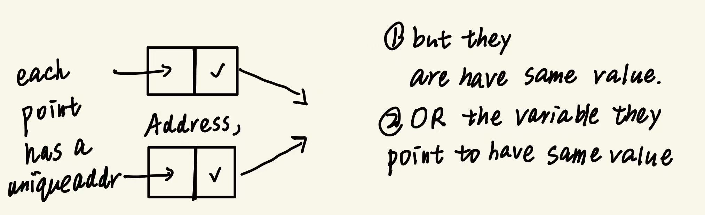
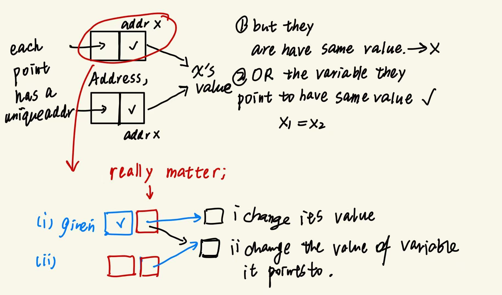

记录一些我在考试中犯错:

1.   NULL 最好写出来; 用 ptr == NULL 或者 ptr != NULL 不会错

2.   如何写递归函数:

     -   先考虑所需的目标(输出1,0 还是返回某个地址/指针)
     -   考虑能用的决定性的状态量.
     -   return: 返回值就是本次函数的结果,讲给到上一次调用它的函数中
     -   递归的过程必须是有限的; 先讨论末期边界的返回结果
     -   得出递推式子: 本次和下次状态的递推关系 
         -   继续细分: 可能有几种输出? 每种输出都是什么样下一次返回值的导致的?
         -   用多个if连接
         -   给一个默认返回值防止报错

     -   backtrack 和 其他如queue,stack递归方式

3.   pre in post order

4.   考试时都写 this->member 保守; 

5.   ```cpp
     int* ptr = new int;  // Allocates memory for a single integer
     int* arr = new int[5]; 
     MyClass* obj = new MyClass;  // Calls constructor
     delete obj;                 // Calls destructor and frees memory
     注意 ptr 是一个指针; new operator 返回指针
     ```

6.   C to LC-3 终于搞定了! 其实这部分题不会太难. 但是需要形成几个关键概念:

     -   每个函数除非在一直recursive地晚上堆, teardown之后stack 就是原来的状态.
     -   把问题分为JSR前后和RET前后:
         -   JSR之前caller 只是push 了arguments R6停在最上面的argument上
         -   JSR 后注意store R7 和 R5; 其中ret val ret addr FP 是从大到小的
         -   R5初始化同R6:第一个local variable
         -   RET之前R5,R7已经恢复, 也就可以推出R6必然在移动,已经pop了所有local variable
         -   所以 calculate & store ret var(R5 #3)一定是第一条代码
         -   RET之后 基本上就是Caller的事了, 把它之前给callee的args全部拿回来(pop) 并且收了return value(可能存在register中,也可能新建了变量,都行)
         -   pop的同时,还有一个效果: R6也复位了

7.   more on pointers in C’s structure and linked list

​    

8.   In C++, if you allocate an array dynamically using `new[]`, you must deallocate it using `delete[]`.

     🔹 Example:

     ```cpp
     int* grid = new int[100];   // dynamically allocate an array
     delete[] grid;              // correctly deallocate the array
     ```

     -   `new[]` allocates memory for an array
     -   `delete[]` deallocates the array
     -   If you use just `delete grid;`, only the **first element** is deallocated (undefined behavior!)
     -   🔥 Common Pitfall

     ```cpp
     int* grid = new int[100];
     delete grid;     // ❌ Wrong: causes memory leak or corruption
     ```

     You **must match** `new[]` with `delete[]`
      (Just like `malloc()` must be paired with `free()` in C)

9.   If the addressibility matters you do need a double ptr. transmit that addr into your function

10.   how trap is running: 

     -   INT signal - INTVector : to jump to a new PC.(service program)

     -   concepts like system/user space . 
     -   SSP and USP as well as PSR ; (use them to store the stack pointer!)
     -   what did RTI do ? change the PSR and restore the SSP & USP

11.   sizeof function in C malloc struct(paddle) array ptr int char :

      | Expression             | Meaning                                     |
      | ---------------------- | ------------------------------------------- |
      | `sizeof(int)`          | Size of an `int` type                       |
      | `sizeof(x)`            | Size of variable `x`                        |
      | `sizeof(ptr)`          | Size of pointer (4 or 8 bytes)              |
      | `sizeof(*ptr)`         | Size of what the pointer points to          |
      | `sizeof(array)`        | Total size of array in bytes                |
      | `sizeof(struct)`       | paddle                                      |
      | `sizeof(a malloc ptr)` | same : the malloc memory is not detectable. |
      | `sizeof(array[0])`     | Size of a single element                    |

12.   32bits/64bits system addressable unit: **a byte** (whereas LC-3 2 bytes) and there address size (**4/8 bytes**)

13.   iterator in C++: you can and should use it to iterate an list; and you are optional when iterate a vector.

      ```cpp
      int main() {
          std::list<int> myList = {10, 20, 30, 40};
      
          // Using iterator
          std::list<int>::iterator it;
          for (it = myList.begin(); it ! =  myList.end(); ++it) {
              std::cout << *it << " ";//remember it is a pointer!
          }
      
          return 0;
      }
      ```

      

14.   this kind of usage is valid `int* a = new int[100];    a[1] = 1;`

15.   ```text
      ~~世界是平坦的。~~ 我们现在知道世界是圆的。delete line
      ```

16.   distinguish LDR and LD for baseR and for PC ; we use LDR for most!!! remember!! also for STR!!!