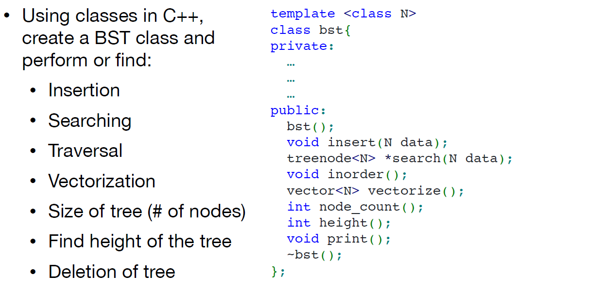
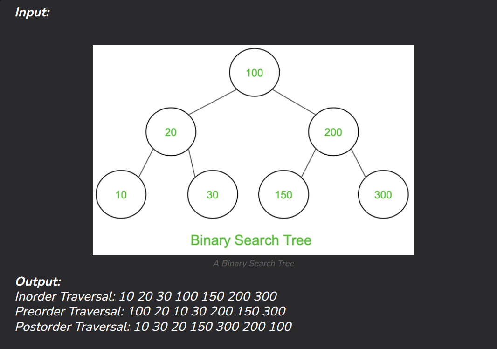

## C++ Trees, traversal, and BSTs intro

What is a tree?

A **tree** is a **non-linear hierarchical data structure** consisting of **nodes**. Comparing with the linear data structure linked- list.

### Common Terminology

-   **Node**: An element in the tree.
-   **Root**: The topmost node.
-   **Leaf**: A node with no children.
-   **Parent / Child**: Relationship between nodes.
-   **Siblings**: each nodes may point to multiple child nodes , which are siblings.
-   **Subtree**: A smaller tree within a tree.
-   **Depth**: Number of edges from root to node.
-   **Height**: Longest path from node to leaf.

### What is a Binary Search Tree?

A **binary search tree** is a tree where each node has **at most two children**, usually named:(Remember, **I am talking about BST directly** (not BT) , which is more common in real practice )

-   `left` and `right`

-   The **left subtree** of a node contains only values **less than** the node’s value.

-   The **right subtree** contains only values **greater than** the node’s value.

-   Both the left and right subtrees must also be BSTs.

```cpp
//basic structure in C++
struct Node {
    int data;
    Node* left;
    Node* right;
	//a constructor
    Node(int val) : data(val), left(nullptr), right(nullptr) {}
    //nullptr are default arguments
};

// Create nodes
    Node* root = new Node(1);
    root->left = new Node(2);
    root->right = new Node(3);
    root->left->left = new Node(4);
    root->left->right = new Node(5);
```

### Tree Traversals

Since BSTs are binary trees, use the same traversal algorithms:

### ✅ Inorder Traversal (Left, Root, Right)

-   Gives **sorted order** in BST!

```cpp
void inorder(Node* root) {
    if (!root) return;
    inorder(root->left); //go left if possible
    cout << root->data << " ";//otherwise access itself(the current place)
    inorder(root->right);//go right at last
}

example:
       10
      /  \
     5   15
5 10 15
```

###:white_check_mark: Preorder (Root, Left, Right) and Postorder (Left, Right, Root)

-   Preorder is Used to **clone** the tree structure.

-   Postorder is Useful for **deleting a tree** safely.

```cpp
Node * preorder(Node* cursor) {
    if (!cursor) return;
    Node *newtree = new cursor;
    newtree->left = preorder(cursor->left);
    newtree->right = preorder(cursor->right);
}
//the reason we choose to use this preorder traverse to clone the tree structure is that, you can build a tree giving a arguments as root .
// you have to create the root first then childrens.
```

```cpp

void * preorder(Node* cursor) {
    if (cursor == NULL) return;
    newtree->left = preorder(cursor->left);
    newtree->right = preorder(cursor->right);
    delete cursor;
}
//the reason we choose postorder traverse to delete a tree is that we must preserve the root for accessing its children, so we delete the children first.
```

### BST Operations (insert , search, delete)

#### Searching in BST

Logic

-   If the node is null → not found.
-   If node's value == key → found.
-   If key < node's value → search left.
-   Else → search right.

#### Deletion in BST

3 Cases:

1.  **Leaf node** → just delete it.
2.  **Node with one child** → replace with child.
3.  **Node with two children** → replace with **inorder successor** (smallest value in right subtree).(it’s also okey if you replace with the largest value in left tree)

#### Insertion in BST

Logic

-   If the tree is empty, insert the node as root.
-   Recursively compare the value:
    -   If smaller → go left.
    -   If larger → go right.

here is an inclusive example.(I includes all the basic functions)

```cpp
#include <iostream>
#include <algorithm> // For std::swap

using namespace std;

struct Node {
    int data;
    Node* left;
    Node* right;
    Node(int val) : data(val), left(nullptr), right(nullptr) {}
};

//insert
Node* insert(Node* root, int val) {
    if (!root) return new Node(val);//null = find it!
    if (val < root->data)
        root->left = insert(root->left, val);
    else if (val > root->data)
        root->right = insert(root->right, val);
    return root;
}

// Find smallest in right subtree
Node* findMin(Node* root) {
    while (root && root->left != nullptr) {
        root = root->left;
    }
    return root; // smallest node
}

Node* search(Node* root, int key) {
    if (!root) return nullptr;

    if (key < root->data)
        return search(root->left, key);
    else if (key > root->data)
        return search(root->right, key);
    return root;
}

Node* deleteNode(Node* root, int key) {
    //return a node
    if (!root) return root; // If the tree is empty or key not found

    if (key < root->data) {
        root->left = deleteNode(root->left, key);
    } else if (key > root->data) {
        root->right = deleteNode(root->right, key);
    } else {
        // Node with only one child or no child
        if (!root->left) {
            Node* temp = root->right;
            delete root;
            return temp;
        } else if (!root->right) {
            Node* temp = root->left;
            delete root;
            return temp;
        }

        // Node with two children: Get the inorder successor (smallest in the right subtree)
        Node* temp = findMin(root->right);

        // Copy the inorder successor's content to this node
        root->data = temp->data;

        // Delete the inorder successor
        root->right = deleteNode(root->right, temp->data);
    }
    return root;//if nothing happens to be delete return self.
}


//a second version: use reference(double pointer in essence)
void deleteNode(Node* &root, int key) {
    if (!root) return;

    if (key < root->data) {
        deleteNode(root->left, key);
    } else if (key > root->data) {
        deleteNode(root->right, key);
    } else {
        // Case 1: No child
        if (!root->left && !root->right) {
            delete root;
            root = nullptr;
        }
        // Case 2: One child (right)
        else if (!root->left) {
            Node* temp = root;
            root = root->right;
            delete temp;
        }
        // Case 3: One child (left)
        else if (!root->right) {
            Node* temp = root;
            root = root->left;
            delete temp;
        }
        // Case 4: Two children
        else {
            Node* temp = findMin(root->right);
            root->data = temp->data;
            deleteNode(root->right, temp->data);
        }
    }
}


void deleteTree(Node* root) {
    if (!root) return;
//post order
    deleteTree(root->left);   // delete left child
    deleteTree(root->right);  // delete right child

    cout << "Deleting node: " << root->data << endl;
    delete root;              // now delete parent
}

void inorder(Node* root) {
    if (!root) return;
    inorder(root->left);
    cout << root->data << " ";
    inorder(root->right);
}

int main() {
    Node* root = nullptr;
    root = insert(root, 10);
    insert(root, 5);
    insert(root, 15);
    insert(root, 2);
    insert(root, 7);

    cout << "Inorder: ";
    inorder(root);  // Output: 2 5 7 10 15
    cout << endl;

    cout<<search(root, 5)->data<<endl;
    root = deleteNode(root, 5);

    cout << "Inorder after deleting 5: ";
    inorder(root);
    cout << endl;

    deleteTree(root);
    root = nullptr; // Important to set root to null after deleting the entire tree
}
```


### Extensions: Height

------

#### 🌲 What is the **Height** of a BST?

>   **Height** = the number of edges from the root node down to the **deepest leaf** node.

example:

```
      10        ← level 0
     /  \
    5    15     ← level 1
         /
       12       ← level 2
```

✅ Height = 2 (3 levels, but we count *edges*, not nodes)

#### The Function to get height of a tree

To Find the height, you need to:

traverse the left and right fork of the subtree.

return height(children) +1 to find of possible height base on left/right

Get the final height by comparing h-l and h-r ; use the maximum

do it recursively.

```cpp
int getHeight(Node* root) {
    if (!root) {
        return 0; // Height of an empty tree is 0 (or -1 depending on convention)
    }

    int leftHeight = getHeight(root->left);   // Height of the left subtree
    int rightHeight = getHeight(root->right); // Height of the right subtree

    // The height of the current node is 1 (for the current node)
    // plus the maximum height of its left or right subtree.
    Height = 1 + max(leftHeight, rightHeight);
    return Height;
}
```


------

#### 📈 Why Does Height Matter?

Because the **height determines how long it takes to search** for something in a BST.

In a BST:

-   Search starts at the root.
-   Each step moves left or right → cuts the problem in half.
-   In **ideal (balanced)** case: each level you move down, you eliminate half the tree.

------

#### ⏱️ Time Complexity vs. Height

| Height of BST | Time to Search | Why?                           |
| ------------- | -------------- | ------------------------------ |
| **log₂(n)**   | **O(log n)**   | Cuts tree in half each time    |
| **n**         | **O(n)**       | Like a linked list — no halves |

------

#### Balanced BST

Suppose you insert values in this order: `1, 2, 3, 4, 5`

Your BST becomes:

```
1
 \
  2
   \
    3
     \
      4
       \
        5
```

-   Looks like a **linked list**.
-   Height = 4
-   Search = **O(n)**

Every search checks **all nodes**!

Now, imagine inserting these values in a **smart order**: `3, 1, 5, 0, 2, 4, 6`

BST becomes:

```
        3
      /   \
     1     5
    / \   / \
   0  2  4  6
```

-   This is **balanced**.
-   Height = log₂(7) ≈ 2.8(2.8 approximate to 3 so we use 3 as a root!)
-   So search is **O(log n)**

------

#### 🧠 Why O(log n) Is Fast

>   Every time you go down a level, you eliminate **half** the remaining possibilities.

It's like searching a **dictionary** or **phonebook**:

-   Look at middle page → too high? Go left.
-   Too low? Go right.

This is **binary search**, and it's **fast** because it halves the work at every step.

------

#### 📌 Summary

-   **Height** = max levels of a tree → more height = more steps to search.
-   **Balanced BST** (height ≈ log₂(n)) → fast operations: O(log n)
-   **Unbalanced BST** (height ≈ n) → slow operations: O(n)

------

how **to keep a BST balanced**, using AVL trees or Red-Black Trees(advanced topics)

### Application: BST Class and several functions



my code implementation: (**Set the private functions as helper function for public functions which is used as method for that class**)

```cpp
#include <iostream>
using namespace std;

template <class T>
class bst {
private:
 //privileged struct defined for the class
    struct treenode {
        treenode* left = nullptr;
        treenode* right = nullptr;
        T data;
        treenode(const T& value) : data(value) {}
    };
//helper function
    treenode* root = nullptr;

    void insert(const T& data, treenode*& node) {
        if (!node) {
            node = new treenode(data);
            return;
        }
        if (data < node->data)
            insert(data, node->left);
        else if (data > node->data)
            insert(data, node->right);
        // else: duplicates are ignored
    }

    void inorder(treenode* node) const {
        if (!node) return;
        inorder(node->left);
        cout << node->data << " ";
        inorder(node->right);
    }

    void destroy(treenode* node) {
        if (!node) return;
        destroy(node->left);
        destroy(node->right);
        delete node;
    }

public:
    bst() = default;

    explicit bst(const T& val) {
        root = new treenode(val);
    }

    ~bst() {
        destroy(root);
    }

    void insert(const T& data) {
        insert(data, root);
    }

    void inorder() const {
        inorder(root);
        cout << endl;
    }
};

```

:one:takeout : two way to declare a class:

First you can declare it outside

```
template <typename T>
struct treenode {
    treenode* left = nullptr;
    treenode* right = nullptr;
    T data;

    treenode(const T& value) : data(value) {}
};

template <typename T>
class bst {
private:
    treenode<T>* root = nullptr;

    // ... other members using treenode<T> ...
};


```

It is also valid perfectly and commonly used in C++ to be inside as a helper function:

```
template <class T>
class bst {
private:
    struct treenode {
        treenode* left = nullptr;
        treenode* right = nullptr;
        T data;
        treenode(const T& value) : data(value) {}
    };
	
    treenode* root = nullptr;
};

in this cas you need to qualify it if you want to use it outside:

typename bst<int>::treenode  // if it were public
 
--why Here typename:When you're inside a template and refer to something like T::X, the compiler can’t know whether X is a type, a value, or a static member — until it sees the actual type of T.

So you use typename to disambiguate and say:

“I promise this thing is a type.”
```


| Defined Inside Class(helper)     | Defined Outside Class              |
| -------------------------------- | ---------------------------------- |
| Scoped only to `bst<T>`          | Available globally                 |
| Encapsulated & protected         | Reusable in other contexts         |
| Easier to keep internal/private  | Requires explicit access control   |
| Cleaner for one-off helper types | Useful if nodes used independently |


my code implementation:

```cpp
first question:
bool isValidBSTHelper(TreeNode* node, long minVal, long maxVal) {
    if (!node) return true;
    if (node->val <= minVal || node->val >= maxVal) return false;
    return isValidBSTHelper(node->left, minVal, node->val) &&
           isValidBSTHelper(node->right, node->val, maxVal);
}

bool isValidBST(TreeNode* root) {
    return isValidBSTHelper(root, LONG_MIN, LONG_MAX);
}

second question can be separated into 3 sub-question:
given a output of preorder/inorder/post-order how to reconstruct the BST?

TreeNode* bstFromPreorder(vector<int>& preorder, int& idx, int bound) {
    if (idx == preorder.size() || preorder[idx] > bound) return nullptr;
    TreeNode* root = new TreeNode(preorder[idx++]);
    root->left = bstFromPreorder(preorder, idx, root->val);
    root->right = bstFromPreorder(preorder, idx, bound);
    //smaller than the current value ->put it to left;
    //if stuff into left is not possible then consider stuffing into right.
    return root;
}

TreeNode* bstFromPreorder(vector<int>& preorder) {
    int idx = 0;
    return bstFromPreorder(preorder, idx, INT_MAX);
}


Third question:
you only need to change the treenode struture inside the class tree, its member should be vector
    
struct TreeNode {
    int val;
    vector<TreeNode*> children;
    TreeNode(int x) : val(x) {}
};

```


:two:tips for ptr usage:

```cpp
int* p1 = new int(42);
int* p2 = p1;

delete p2;// ✅ OK — as long as you don't delete p1 again
p1 = nullptr;  // ✅ prevent accidental use
p2 = nullptr;  // ✅ optional, but clearer

 otherwise these might cause undefined error:
*p1 = 100;   // ❌ undefined behavior
delete p1;   // ❌ double delete — undefined behavior

```

:three:tips for `this->root vs root`

The `this->` is optional **unless** there’s a **naming conflict**.

C++ only requires `this->` when:

1.  There's a **template-dependent name** (in templates, like CRTP cases)
2.  You have a **local variable** with the same name as a member

Example:

```cpp
class A {
    int value;
public:
    void set(int value) {
        this->value = value;  // ❗ disambiguate member vs parameter
    }
};

```

:four:tip : vscode 按() 左右90都按,会有高效光标跳转! 

:five:tip:

### ❌ Default parameter `treenode* root = root` is not valid

C++ doesn’t allow you to refer to a **non-static member** in a **default parameter**:

```cpp
!!!
void inorder(treenode* node = root)   // ❌ Error
```

✅ **Fix: Split public/private version:**

```cpp
 codevoid inorder() {
    inorder(root);
}
void inorder(treenode* node) {
    if (!node) return;
    inorder(node->left);
    cout << node->data << " ";
    inorder(node->right);
}
```


